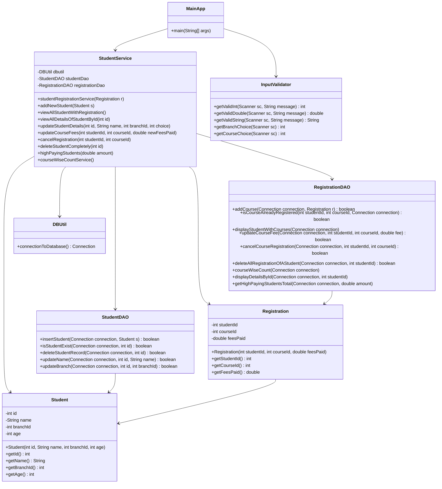
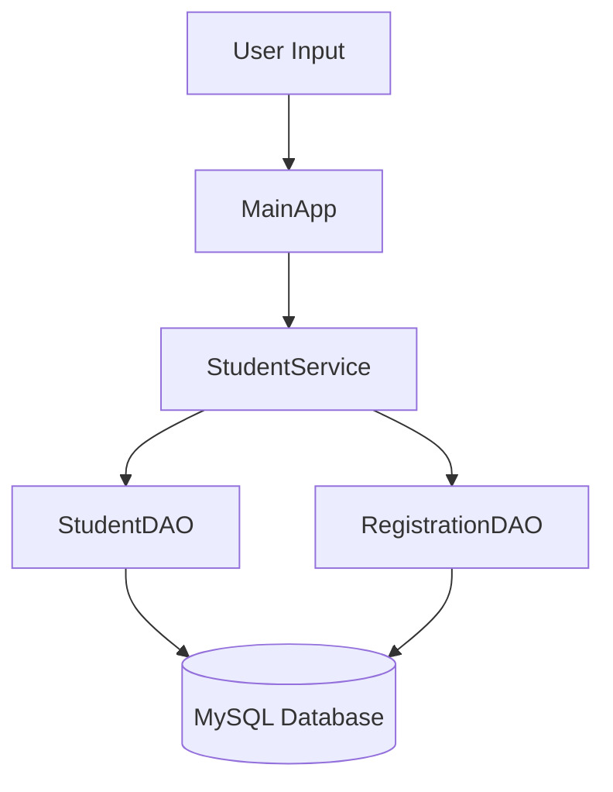

# Student Course Registration Management System

A console-based Java application developed using JDBC and MySQL for managing students, course registrations, fee management, and report generation.

The project follows a layered architecture approach and demonstrates practical implementation of JDBC connectivity, transaction management, SQL joins, aggregation queries, normalization, and input validation.

GitHub supports Mermaid diagrams directly inside README markdown files. ([GitHub Docs][1])

---

# Features

## Student Management

* Add New Student
* Search Student by ID
* Update Student Name
* Update Student Branch
* Delete Student Completely

---

## Course Registration

* Register Student for Course
* Update Course Fee
* Cancel Course Registration

---

## Reports

* View All Students with Registered Courses
* Generate High Paying Students Report
* Generate Course-wise Student Count Report

---

# Technologies Used

| Technology   | Purpose                   |
| ------------ | ------------------------- |
| Java         | Core Programming Language |
| JDBC         | Database Connectivity     |
| MySQL        | Relational Database       |
| SQL          | Query Execution           |
| OOPs         | Application Design        |
| Git & GitHub | Version Control           |

---

# Project Architecture

The project follows a layered architecture structure:

* Presentation Layer
* Service Layer
* DAO Layer
* Model Layer
* Utility Layer

This improves:

* Code Maintainability
* Reusability
* Scalability
* Separation of Concerns

---

# Database Design

The database is normalized using foreign key relationships.

---

## student Table

Stores student details.

| Column    | Type    |
| --------- | ------- |
| id        | INT     |
| name      | VARCHAR |
| age       | INT     |
| branch_id | INT     |

---

## branch Table

Stores available branches.

| Column      | Type    |
| ----------- | ------- |
| branch_id   | INT     |
| branch_name | VARCHAR |

---

## course Table

Stores available courses.

| Column      | Type    |
| ----------- | ------- |
| course_id   | INT     |
| course_name | VARCHAR |

---

## registration Table

Stores course registration details.

| Column     | Type   |
| ---------- | ------ |
| reg_id     | INT    |
| student_id | INT    |
| course_id  | INT    |
| fees_paid  | DOUBLE |

---

# Database Normalization

The project follows normalization principles by separating:

* Student Data
* Branch Data
* Course Data
* Registration Data

This avoids:

* Data Redundancy
* Duplicate Entries
* Inconsistent Data Storage

---

# Transaction Management

Transaction management is implemented in critical operations such as:

* Student Course Registration
* Delete Student Completely

If any operation fails during execution, all changes are rolled back to maintain consistency and atomicity.

---

# Input Validation

A dedicated `InputValidator` utility class is implemented for handling console input safely.

## Validations Included

* Integer Validation
* Double Validation
* String Validation
* Branch Selection Validation
* Course Selection Validation

This prevents invalid user input and runtime exceptions.

---

# SQL Concepts Used

The project demonstrates practical implementation of:

* INNER JOIN
* LEFT JOIN
* GROUP BY
* HAVING Clause
* Aggregation Functions
* Foreign Keys
* Transaction Handling

---

# Project Structure

```text
src
│
├── app
│   └── MainApp.java
│
├── dao
│   ├── StudentDAO.java
│   └── RegistrationDAO.java
│
├── model
│   ├── Student.java
│   └── Registration.java
│
├── service
│   └── StudentService.java
│
├── util
│   └── DBUtil.java
│
└── inputvalidator
    └── InputValidator.java
```

---

# Class Diagram



---

# Application Workflow



---

# How to Run the Project

## Clone Repository

```bash
git clone <repository-url>
```

---

## Configure Database

Update MySQL database credentials inside:

```text
DBUtil.java
```

---

## Run Application

Run:

```text
MainApp.java
```

---

# Key Learning Outcomes

This project helped in understanding:

* JDBC Connectivity
* Layered Architecture
* CRUD Operations
* SQL Query Writing
* Transaction Management
* Database Normalization
* Exception Handling
* Input Validation
* Aggregation Queries

---

# Author

Harshit Srivastava

[1]: https://docs.github.com/en/get-started/writing-on-github/working-with-advanced-formatting/creating-diagrams?utm_source=chatgpt.com "Creating Mermaid diagrams"
